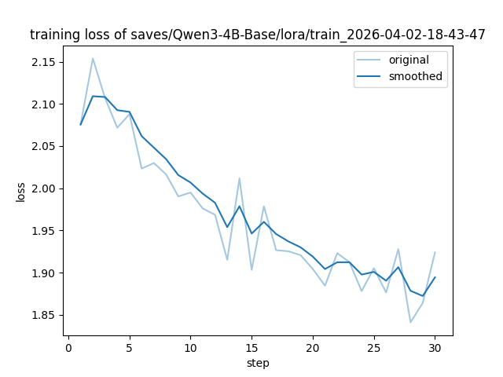

# 实验报告：Task 1 (微调模型入门实战)

**实验名称**：基于MDD-5k的数据集微调一个精神病学诊断的医生咨询师模型
**平台**：ModelScope (魔塔社区) DSW
**基座模型**：Qwen3-4B-Base

## 一、 实验内容
本实验通过微调 Qwen3 模型，使其具备初步的心理咨询师角色意识。针对原始 MDD-5k 数据集的嵌套 JSON 格式，编写了递归解析脚本 `prepare_mdd.py`，并处理了对话角色对齐问题。

## 二、 遇到的问题与解决
* **问题**：原始对话存在“人类连续发言”，不符合 Chat 模板。
* **解决**：在预处理脚本中开发了自动合并逻辑。
* **策略**：采用“小样本过拟合验证”，抽取 30 条核心数据极速跑通全流程。

## 三、 实验结果与资产
* **Train Loss**: 1.964
* **Eval Loss**: 2.0755
* **ROUGE-1**: 21.47
* **结论**: 模型 Loss 曲线平稳收敛，成功习得了初步的领域对话特征。

### 训练 Loss 曲线展示

